# Design Document: Nayaymadad
## Overview

Nayaymadad is a voice-first, multilingual legal assistance platform designed for Indian citizens. The system architecture follows a client-server model with a React Native mobile application communicating with a Python FastAPI backend that orchestrates multiple AI services from Sarvam AI (India's sovereign AI platform).

### Design Prototype

Explore the interactive design prototype: [Nayaymadad Design Mock](https://nayaymadad.netlify.app/)

This prototype demonstrates the user interface, user flows, and key interactions across all features of the application.

### Architecture Philosophy

1. **Voice-First Design**: All interactions prioritize voice input/output over text, with Sarvam AI's Saaras V3 (STT) and Bulbul V3 (TTS) as primary interfaces
2. **Offline-Capable**: Smart caching strategy using MMKV for conversations and results, with clear online/offline state indicators
3. **AI-Native**: Sarvam-M LLM with RAG pipeline over Indian legal corpus for accurate, cited responses
4. **Low-Bandwidth Optimized**: Image compression, adaptive audio streaming, and efficient API payloads for 2G networks
5. **Multilingual-First**: All components designed for 5 Indian languages (Hindi, English, Tamil, Telugu, Malayalam) with i18n throughout

### Technology Stack Summary

**Frontend (Mobile)**:

- React Native 0.76+ with Expo SDK 52+
- TypeScript for type safety
- React Native Paper (Material Design 3) for UI components
- Zustand for state management
- react-i18next for internationalization
- MMKV for fast local caching
- expo-av for audio recording/playback
- expo-camera and expo-image-picker for document capture

**Backend (API Server)**:

- Python 3.12+ with FastAPI 0.115+
- LangChain + LangGraph for AI orchestration
- Sarvam AI SDK (sarvam-ai) for all Indian language AI
- Amazon Bedrock (Claude 3 Haiku) for LLM fallback
- PostgreSQL 16 for relational data
- Qdrant for vector embeddings (Legal_Corpus)
- Redis 7+ for caching and task queues
- Celery for background processing
- Google Cloud Vision for OCR
- Firebase Auth for phone OTP

**Infrastructure**:

- Docker + Docker Compose for local development
- Google Cloud Platform (asia-south1 Mumbai region)
- Google Cloud Run for serverless backend deployment
- Amazon S3 (ap-south-1 Mumbai) for document and audio storage
- Amazon Bedrock for LLM fallback (Claude 3 Haiku)

## Architecture

### System Architecture Diagram

```mermaid
graph TB
    subgraph "Mobile App (React Native + Expo)"
        UI["UI Layer
React Native Paper"]
        State["State Management
Zustand Stores"]
        Cache["Local Cache
MMKV"]
        Audio["Audio Services
expo-av"]
        Camera["Camera/Gallery
expo-camera/image-picker"]
    end

    subgraph "Backend API (FastAPI)"
        API["API Routes
/api/v1/*"]
        Auth["Auth Service
Firebase Admin"]
        Services[Business Logic Layer]
        AI["AI Orchestration
LangChain/LangGraph"]
    end

    subgraph "AI Services (Sarvam AI)"
        STT["Saaras V3
Speech-to-Text"]
        TTS["Bulbul V3
Text-to-Speech"]
        LLM["Sarvam-M
LLM Primary"]
        Translate["Sarvam-Translate
Mayura"]
    end

    subgraph "AWS Services"
        Bedrock["Amazon Bedrock
Claude 3 Haiku Fallback"]
        S3["Amazon S3
Document Storage"]
    end

    subgraph "Data Layer"
        Postgres[("PostgreSQL
User/Conversation Data")]
        Qdrant[("Qdrant
Legal Corpus Vectors")]
        Redis[("Redis
Cache/Queue")]
    end

    subgraph "External Services"
        OCR["Google Cloud Vision
OCR"]
        FirebaseAuth["Firebase Auth
Phone OTP"]
        Maps["Google Maps API
Legal Aid Locations"]
    end

    UI --> State
    State --> Cache
    UI --> Audio
    UI --> Camera
    State --> API
    
    API --> Auth
    API --> Services
    Services --> AI
    
    AI --> STT
    AI --> TTS
    AI --> LLM
    AI --> Bedrock
    AI --> Translate
    
    Services --> Postgres
    Services --> Qdrant
    Services --> Redis
    Services --> S3
    Services --> OCR
    
    Auth --> FirebaseAuth
    UI --> Maps

    %% Styling
    classDef mobileClass fill:#4CAF50,stroke:#2E7D32,stroke-width:2px,color:#fff
    classDef backendClass fill:#2196F3,stroke:#1565C0,stroke-width:2px,color:#fff
    classDef aiClass fill:#FF9800,stroke:#E65100,stroke-width:2px,color:#fff
    classDef awsClass fill:#FF5722,stroke:#BF360C,stroke-width:2px,color:#fff
    classDef dataClass fill:#9C27B0,stroke:#4A148C,stroke-width:2px,color:#fff
    classDef externalClass fill:#607D8B,stroke:#263238,stroke-width:2px,color:#fff

    class UI,State,Cache,Audio,Camera mobileClass
    class API,Auth,Services,AI backendClass
    class STT,TTS,LLM,Translate aiClass
    class Bedrock,S3 awsClass
    class Postgres,Qdrant,Redis dataClass
    class OCR,FirebaseAuth,Maps externalClass

    %% Clickable links
    click UI "https://reactnative.dev" "React Native Documentation"
    click State "https://zustand-demo.pmnd.rs" "Zustand Documentation"
    click API "https://fastapi.tiangolo.com" "FastAPI Documentation"
    click STT "https://www.sarvam.ai" "Sarvam AI Platform"
    click TTS "https://www.sarvam.ai" "Sarvam AI Platform"
    click LLM "https://www.sarvam.ai" "Sarvam AI Platform"
    click Translate "https://www.sarvam.ai" "Sarvam AI Platform"
    click Bedrock "https://aws.amazon.com/bedrock" "Amazon Bedrock"
    click S3 "https://aws.amazon.com/s3" "Amazon S3"
    click Postgres "https://www.postgresql.org" "PostgreSQL"
    click Qdrant "https://qdrant.tech" "Qdrant Vector Database"
    click Redis "https://redis.io" "Redis"
    click OCR "https://cloud.google.com/vision" "Google Cloud Vision"
    click FirebaseAuth "https://firebase.google.com/docs/auth" "Firebase Auth"
    click Maps "https://developers.google.com/maps" "Google Maps API"
```



### Component Interaction Flow

**Voice Query Flow**:

1. User taps microphone → Nayaymadad_App records audio via expo-av
2. Audio sent to Backend_API `/api/v1/chat/voice` endpoint
3. Backend_API forwards audio to Sarvam Saaras V3 STT
4. Transcribed text returned to app and displayed
5. Backend_API processes query through RAG pipeline:
   - Query embedding generated
   - Relevant legal documents retrieved from Qdrant
   - Context + query sent to Sarvam-M LLM
6. LLM response generated with citations
7. Response text sent to Sarvam Bulbul V3 TTS
8. Text + audio URL returned to app
9. App displays text and auto-plays audio
10. Conversation cached in MMKV for offline access

**Document Analysis Flow**:

1. User captures/selects image → compressed to <1MB
2. Image uploaded to Backend_API `/api/v1/documents/analyze`
3. Backend_API uploads to Google Cloud Storage
4. Google Cloud Vision OCR extracts text
5. Extracted text analyzed by Sarvam-M LLM with specialized prompt
6. Analysis results (type, deadlines, risk, options) generated
7. Results cached in Redis (1 hour TTL) and PostgreSQL
8. Results returned to app and cached in MMKV
9. User can view offline from cache

## Components and Interfaces

### Frontend Components

#### 1. Authentication Module

**Components**:

- `OnboardingScreen.tsx`: Language selection and phone auth flow
- `useAuthStore.ts`: Zustand store for auth state (token, user profile)

**Key Interfaces**:

```typescript
interface UserProfile {
  id: string;
  phoneNumber: string;
  name: string;
  preferredLanguage: 'en' | 'hi' | 'ta' | 'te' | 'ml';
  state: string;
  occupationCategory: string;
  createdAt: Date;
}

interface AuthState {
  isAuthenticated: boolean;
  user: UserProfile | null;
  token: string | null;
  login: (phoneNumber: string, otp: string) => Promise<void>;
  logout: () => void;
}
```

#### 2. Voice Chat Module

**Components**:

- `ChatScreen.tsx`: Main chat interface with message list
- `MessageBubble.tsx`: Individual message display with audio playback
- `ChatInput.tsx`: Text input with voice recording button
- `VoiceRecordingModal.tsx`: Recording UI with waveform visualization
- `useChatStore.ts`: Zustand store for conversation state

**Key Interfaces**:

```typescript
interface Message {
  id: string;
  role: 'user' | 'assistant';
  content: string;
  audioUrl?: string;
  citations?: Citation[];
  timestamp: Date;
}

interface Citation {
  actName: string;
  section: string;
  description: string;
  fullText?: string;
}

interface ChatState {
  conversations: Map<string, Message[]>;
  activeConversationId: string | null;
  isRecording: boolean;
  isProcessing: boolean;
  sendVoiceMessage: (audioBlob: Blob) => Promise<void>;
  sendTextMessage: (text: string) => Promise<void>;
}
```

**Services**:

- `chatService.ts`: API client for chat endpoints
- `speechService.ts`: Wrapper for audio recording and playback

```typescript
// chatService.ts
async function sendVoiceQuery(
  audioBlob: Blob,
  language: string
): Promise<{ transcription: string; response: string; audioUrl: string; citations: Citation[] }>;

async function sendTextQuery(
  text: string,
  conversationId: string,
  language: string
): Promise<{ response: string; audioUrl: string; citations: Citation[] }>;
```

#### 3. Document Analysis Module

**Components**:

- `DocumentScanScreen.tsx`: Camera/gallery interface
- `AnalysisResultScreen.tsx`: Structured display of analysis results
- `RiskIndicator.tsx`: Visual risk level display (Low/Medium/High/Critical)
- `DeadlineCard.tsx`: Countdown timer for deadlines
- `SolutionOptionCard.tsx`: Mitigation option display (A, B, C)

**Key Interfaces**:

```typescript
interface DocumentAnalysis {
  id: string;
  documentType: 'legal_notice' | 'contract' | 'other';
  issuingAuthority?: string;
  summary: string;
  riskLevel: 'low' | 'medium' | 'high' | 'critical';
  deadlines: Deadline[];
  mitigationOptions: MitigationOption[];
  ocrConfidence: number;
  analyzedAt: Date;
}

interface Deadline {
  description: string;
  date: Date;
  daysRemaining: number;
  isPassed: boolean;
}

interface MitigationOption {
  label: 'A' | 'B' | 'C';
  title: string;
  description: string;
  pros: string[];
  cons: string[];
  estimatedCost: string;
  estimatedTime: string;
}
```

**Services**:

- `documentService.ts`: Document upload and analysis API client

```typescript
async function analyzeDocument(
  imageUri: string,
  documentType: 'notice' | 'contract',
  language: string
): Promise<DocumentAnalysis>;
```

#### 4. Contract Analysis Module

**Components**:

- `ContractAnalysisScreen.tsx`: Contract upload and results
- `ClauseChecklist.tsx`: Missing/risky clause display with color coding

**Key Interfaces**:

```typescript
interface ContractAnalysis {
  id: string;
  contractType: string;
  riskScore: number; // 0-100
  missingClauses: ClauseIssue[];
  riskyC lauses: ClauseIssue[];
  analyzedAt: Date;
}

interface ClauseIssue {
  clauseName: string;
  importance: 'critical' | 'important' | 'recommended';
  explanation: string;
  suggestedLanguage?: string;
  location?: string; // For risky clauses
}
```

#### 5. Compliance Navigator Module

**Components**:

- `ComplianceScreen.tsx`: Business info form and checklist
- `ComplianceChecklist.tsx`: Task list with completion tracking
- `RegistrationCard.tsx`: Step-by-step guide for each task

**Key Interfaces**:

```typescript
interface ComplianceTask {
  id: string;
  name: string;
  description: string;
  priority: number;
  deadline?: Date;
  estimatedCost: string;
  requiredDocuments: string[];
  portalUrl?: string;
  steps: string[];
  isCompleted: boolean;
}

interface BusinessProfile {
  businessType: string;
  state: string;
  annualRevenue: number;
  employeeCount: number;
}
```

#### 6. Scheme Finder Module

**Components**:

- `SchemesScreen.tsx`: Scheme list with filters
- `SchemeCard.tsx`: Individual scheme display
- `EligibilityForm.tsx`: Additional eligibility questions

**Key Interfaces**:

```typescript
interface GovernmentScheme {
  id: string;
  name: string;
  nameTranslated: string;
  description: string;
  benefitAmount?: string;
  eligibilityCriteria: string[];
  requiredDocuments: string[];
  applicationProcess: string[];
  applicationDeadline?: Date;
  officialUrl: string;
  relevanceScore: number;
}
```

#### 7. Legal Aid Locator Module

**Components**:

- `LegalAidMapScreen.tsx`: Map view with markers
- `LegalAidCenterCard.tsx`: Center details bottom sheet

**Key Interfaces**:

```typescript
interface LegalAidCenter {
  id: string;
  name: string;
  address: string;
  coordinates: { latitude: number; longitude: number };
  phoneNumber: string;
  servicesOffered: string[];
  operatingHours: string;
  distanceKm: number;
}
```

### Backend Components

#### 1. API Layer (`app/api/v1/`)

**Endpoints**:

```python
# chat.py
POST /api/v1/chat/voice
  - Body: { audio: File, language: str, conversation_id: Optional[str] }
  - Returns: { transcription: str, response: str, audio_url: str, citations: List[Citation] }

POST /api/v1/chat/text
  - Body: { message: str, conversation_id: str, language: str }
  - Returns: { response: str, audio_url: str, citations: List[Citation] }

GET /api/v1/chat/conversations
  - Returns: List[Conversation]

# documents.py
POST /api/v1/documents/analyze
  - Body: { image: File, document_type: str, language: str }
  - Returns: DocumentAnalysis

POST /api/v1/documents/analyze-contract
  - Body: { image: File, language: str }
  - Returns: ContractAnalysis

GET /api/v1/documents/{document_id}
  - Returns: DocumentAnalysis

# schemes.py
GET /api/v1/schemes/match
  - Query: user_id
  - Returns: List[GovernmentScheme]

GET /api/v1/schemes/{scheme_id}
  - Returns: GovernmentScheme

# compliance.py
POST /api/v1/compliance/analyze
  - Body: BusinessProfile
  - Returns: List[ComplianceTask]

PUT /api/v1/compliance/tasks/{task_id}
  - Body: { is_completed: bool }
  - Returns: ComplianceTask

# legal_aid.py
GET /api/v1/legal-aid/nearby
  - Query: latitude, longitude, radius_km
  - Returns: List[LegalAidCenter]

# auth.py
POST /api/v1/auth/send-otp
  - Body: { phone_number: str }
  - Returns: { success: bool }

POST /api/v1/auth/verify-otp
  - Body: { phone_number: str, otp: str }
  - Returns: { token: str, user: UserProfile }
```

#### 2. Service Layer (`app/services/`)

**chat_service.py**:

```python
class ChatService:
    def __init__(self, llm_client, rag_pipeline, tts_client):
        self.llm = llm_client
        self.rag = rag_pipeline
        self.tts = tts_client
    
    async def process_voice_query(
        self,
        audio_bytes: bytes,
        language: str,
        conversation_id: Optional[str]
    ) -> ChatResponse:
        # 1. Transcribe with Sarvam STT
        # 2. Retrieve context from RAG
        # 3. Generate response with Sarvam-M
        # 4. Convert to speech with Sarvam TTS
        # 5. Store conversation in PostgreSQL
        # 6. Return response with audio URL
        pass
    
    async def process_text_query(
        self,
        text: str,
        language: str,
        conversation_id: str
    ) -> ChatResponse:
        # Similar to voice but skip STT
        pass
```

**document_service.py**:

```python
class DocumentService:
    def __init__(self, ocr_client, llm_client, storage_client):
        self.ocr = ocr_client
        self.llm = llm_client
        self.storage = storage_client
    
    async def analyze_legal_notice(
        self,
        image_bytes: bytes,
        language: str
    ) -> DocumentAnalysis:
        # 1. Upload to Google Cloud Storage
        # 2. Extract text with Google Cloud Vision OCR
        # 3. Analyze with Sarvam-M using notice analyzer prompt
        # 4. Extract deadlines with regex + LLM
        # 5. Assign risk level based on urgency
        # 6. Generate mitigation options
        # 7. Translate to user language if needed
        # 8. Store in PostgreSQL and cache in Redis
        pass
    
    async def analyze_contract(
        self,
        image_bytes: bytes,
        language: str
    ) -> ContractAnalysis:
        # Similar flow with contract-specific prompts
        pass
```

**scheme_service.py**:

```python
class SchemeService:
    def __init__(self, db_session):
        self.db = db_session
    
    async def match_schemes(
        self,
        user_profile: UserProfile
    ) -> List[GovernmentScheme]:
        # 1. Query schemes database with eligibility filters
        # 2. Calculate relevance score for each scheme
        # 3. Rank by relevance and benefit amount
        # 4. Return top 20 matches
        pass
```

#### 3. AI Layer (`app/ai/`)

**llm.py**:

```python
from sarvam import SarvamClient

class LLMClient:
    def __init__(self, api_key: str):
        self.client = SarvamClient(api_key=api_key)
    
    async def generate_response(
        self,
        prompt: str,
        context: str,
        language: str,
        system_prompt: str
    ) -> str:
        # Call Sarvam-M API with context and prompt
        response = await self.client.chat.completions.create(
            model="sarvam-m",
            messages=[
                {"role": "system", "content": system_prompt},
                {"role": "user", "content": f"Context: {context}\n\nQuery: {prompt}"}
            ],
            language=language,
            temperature=0.7
        )
        return response.choices[0].message.content
```

**rag.py**:

```python
from langchain.vectorstores import Qdrant
from langchain.embeddings import HuggingFaceEmbeddings

class RAGPipeline:
    def __init__(self, qdrant_client, embeddings_model):
        self.vectorstore = Qdrant(
            client=qdrant_client,
            collection_name="legal_corpus",
            embeddings=embeddings_model
        )
    
    async def retrieve_context(
        self,
        query: str,
        top_k: int = 5
    ) -> List[Document]:
        # 1. Generate query embedding
        # 2. Search Qdrant for similar documents
        # 3. Return top_k most relevant documents with metadata
        docs = await self.vectorstore.asimilarity_search(query, k=top_k)
        return docs
```

**prompts/legal_assistant.py**:

```python
LEGAL_ASSISTANT_SYSTEM_PROMPT = """
You are Nayaymadad, a helpful legal assistant for Indian citizens. Your role is to:

1. Explain Indian laws, rights, and legal procedures in simple, clear language
2. Avoid legal jargon - use everyday words and examples
3. Always cite specific laws (Act name, section number) when referencing legal provisions
4. Acknowledge uncertainty when you're not confident about an answer
5. Remind users that you provide guidance, not legal advice, and serious matters require a lawyer
6. Be culturally sensitive and aware of Indian legal context
7. Respond in the user's preferred language ({language})

When answering:
- Start with a direct answer to the question
- Provide relevant legal context and citations
- Suggest practical next steps when appropriate
- Use examples relevant to Indian situations

Context from legal corpus:
{context}

User query:
{query}
"""

NOTICE_ANALYZER_PROMPT = """
You are analyzing a legal notice for an Indian citizen. Extract and provide:

1. Notice Type: (court summons, eviction notice, tax notice, legal demand, etc.)
2. Issuing Authority: (court name, government department, company, etc.)
3. Key Information: Main points in simple language
4. Deadlines: All dates mentioned with specific actions required
5. Risk Level: (Low/Medium/High/Critical) based on urgency and consequences
6. Summary: 2-3 sentence plain-language explanation
7. Mitigation Options: 3 concrete action paths (A, B, C) with pros, cons, costs

OCR Text:
{ocr_text}

Respond in {language}.
"""
```

**guardrails.py**:

```python
class SafetyGuardrails:
    FORBIDDEN_TOPICS = [
        "how to commit crimes",
        "how to evade legal obligations",
        "definitive legal advice on criminal matters"
    ]
    
    def check_query(self, query: str) -> Tuple[bool, Optional[str]]:
        # Check if query contains forbidden topics
        # Return (is_safe, warning_message)
        pass
    
    def check_response(self, response: str) -> str:
        # Ensure response includes appropriate disclaimers
        # Add warnings for sensitive topics
        pass
```

## Data Models

### PostgreSQL Schema

```sql
-- Users table
CREATE TABLE users (
    id UUID PRIMARY KEY DEFAULT gen_random_uuid(),
    phone_number VARCHAR(15) UNIQUE NOT NULL,
    name VARCHAR(255),
    preferred_language VARCHAR(5) NOT NULL,
    state VARCHAR(100),
    occupation_category VARCHAR(100),
    created_at TIMESTAMP DEFAULT NOW(),
    updated_at TIMESTAMP DEFAULT NOW()
);

-- Conversations table
CREATE TABLE conversations (
    id UUID PRIMARY KEY DEFAULT gen_random_uuid(),
    user_id UUID REFERENCES users(id) ON DELETE CASCADE,
    title VARCHAR(255),
    created_at TIMESTAMP DEFAULT NOW(),
    updated_at TIMESTAMP DEFAULT NOW()
);

-- Messages table
CREATE TABLE messages (
    id UUID PRIMARY KEY DEFAULT gen_random_uuid(),
    conversation_id UUID REFERENCES conversations(id) ON DELETE CASCADE,
    role VARCHAR(20) NOT NULL, -- 'user' or 'assistant'
    content TEXT NOT NULL,
    audio_url VARCHAR(500),
    citations JSONB,
    created_at TIMESTAMP DEFAULT NOW()
);

-- Documents table
CREATE TABLE documents (
    id UUID PRIMARY KEY DEFAULT gen_random_uuid(),
    user_id UUID REFERENCES users(id) ON DELETE CASCADE,
    document_type VARCHAR(50) NOT NULL,
    storage_url VARCHAR(500) NOT NULL,
    ocr_text TEXT,
    ocr_confidence FLOAT,
    analysis_result JSONB,
    created_at TIMESTAMP DEFAULT NOW()
);

-- Compliance tasks table
CREATE TABLE compliance_tasks (
    id UUID PRIMARY KEY DEFAULT gen_random_uuid(),
    user_id UUID REFERENCES users(id) ON DELETE CASCADE,
    task_name VARCHAR(255) NOT NULL,
    description TEXT,
    priority INT,
    deadline DATE,
    is_completed BOOLEAN DEFAULT FALSE,
    completed_at TIMESTAMP,
    created_at TIMESTAMP DEFAULT NOW()
);

-- Government schemes table (pre-populated)
CREATE TABLE government_schemes (
    id UUID PRIMARY KEY DEFAULT gen_random_uuid(),
    name VARCHAR(255) NOT NULL,
    name_hi VARCHAR(255),
    name_ta VARCHAR(255),
    name_te VARCHAR(255),
    name_ml VARCHAR(255),
    description TEXT NOT NULL,
    eligibility_criteria JSONB NOT NULL,
    benefit_amount VARCHAR(100),
    required_documents JSONB,
    application_process JSONB,
    official_url VARCHAR(500),
    state VARCHAR(100),
    category VARCHAR(100),
    created_at TIMESTAMP DEFAULT NOW()
);

-- Legal aid centers table (pre-populated)
CREATE TABLE legal_aid_centers (
    id UUID PRIMARY KEY DEFAULT gen_random_uuid(),
    name VARCHAR(255) NOT NULL,
    address TEXT NOT NULL,
    latitude DECIMAL(10, 8) NOT NULL,
    longitude DECIMAL(11, 8) NOT NULL,
    phone_number VARCHAR(15),
    services_offered JSONB,
    operating_hours VARCHAR(255),
    state VARCHAR(100),
    district VARCHAR(100),
    created_at TIMESTAMP DEFAULT NOW()
);

CREATE INDEX idx_legal_aid_location ON legal_aid_centers USING GIST (
    ll_to_earth(latitude, longitude)
);
```

### Pydantic Models

```python
from pydantic import BaseModel, Field
from typing import Optional, List
from datetime import datetime
from enum import Enum

class Language(str, Enum):
    ENGLISH = "en"
    HINDI = "hi"
    TAMIL = "ta"
    TELUGU = "te"
    MALAYALAM = "ml"

class UserProfile(BaseModel):
    id: str
    phone_number: str
    name: Optional[str]
    preferred_language: Language
    state: Optional[str]
    occupation_category: Optional[str]
    created_at: datetime

class Message(BaseModel):
    id: str
    conversation_id: str
    role: str  # 'user' or 'assistant'
    content: str
    audio_url: Optional[str]
    citations: Optional[List[dict]]
    created_at: datetime

class Citation(BaseModel):
    act_name: str
    section: str
    description: str
    full_text: Optional[str]

class RiskLevel(str, Enum):
    LOW = "low"
    MEDIUM = "medium"
    HIGH = "high"
    CRITICAL = "critical"

class Deadline(BaseModel):
    description: str
    date: datetime
    days_remaining: int
    is_passed: bool

class MitigationOption(BaseModel):
    label: str  # 'A', 'B', or 'C'
    title: str
    description: str
    pros: List[str]
    cons: List[str]
    estimated_cost: str
    estimated_time: str

class DocumentAnalysis(BaseModel):
    id: str
    document_type: str
    issuing_authority: Optional[str]
    summary: str
    risk_level: RiskLevel
    deadlines: List[Deadline]
    mitigation_options: List[MitigationOption]
    ocr_confidence: float
    analyzed_at: datetime

class ClauseIssue(BaseModel):
    clause_name: str
    importance: str  # 'critical', 'important', 'recommended'
    explanation: str
    suggested_language: Optional[str]
    location: Optional[str]

class ContractAnalysis(BaseModel):
    id: str
    contract_type: str
    risk_score: int  # 0-100
    missing_clauses: List[ClauseIssue]
    risky_clauses: List[ClauseIssue]
    analyzed_at: datetime

class ComplianceTask(BaseModel):
    id: str
    name: str
    description: str
    priority: int
    deadline: Optional[datetime]
    estimated_cost: str
    required_documents: List[str]
    portal_url: Optional[str]
    steps: List[str]
    is_completed: bool

class GovernmentScheme(BaseModel):
    id: str
    name: str
    name_translated: str
    description: str
    benefit_amount: Optional[str]
    eligibility_criteria: List[str]
    required_documents: List[str]
    application_process: List[str]
    application_deadline: Optional[datetime]
    official_url: str
    relevance_score: float

class LegalAidCenter(BaseModel):
    id: str
    name: str
    address: str
    coordinates: dict  # {latitude, longitude}
    phone_number: str
    services_offered: List[str]
    operating_hours: str
    distance_km: float
```

### Qdrant Vector Store Schema

```python
# Collection: legal_corpus
{
    "collection_name": "legal_corpus",
    "vectors": {
        "size": 768,  # HuggingFace embedding dimension
        "distance": "Cosine"
    },
    "payload_schema": {
        "act_name": "keyword",
        "section": "keyword",
        "content": "text",
        "language": "keyword",
        "category": "keyword",  # 'civil', 'criminal', 'labor', 'tax', etc.
        "source_url": "keyword"
    }
}
```

## Correctness Properties

A property is a characteristic or behavior that should hold true across all valid executions of a system—essentially, a formal statement about what the system should do. Properties serve as the bridge between human-readable specifications and machine-verifiable correctness guarantees.

### Property 1: Language Persistence Round Trip

*For any* language selection from the 5 supported languages (Hindi, English, Tamil, Telugu, Malayalam), when a user selects a language, persists it, and then retrieves the preference, the retrieved language SHALL be identical to the selected language.

**Validates: Requirements 1.2**

### Property 2: Authentication Token Generation

*For any* valid OTP and phone number combination, when the Backend_API verifies the OTP, it SHALL return both an authentication token and a User_Profile object.

**Validates: Requirements 1.4**

### Property 3: Profile Caching After Onboarding

*For any* completed onboarding flow, when a user finishes onboarding, the User_Profile SHALL be present in the local MMKV cache.

**Validates: Requirements 1.6**

### Property 4: Audio Upload After Recording

*For any* recorded audio blob, when a user finishes recording and releases the microphone button, the audio SHALL be sent to the Backend_API.

**Validates: Requirements 2.2**

### Property 5: STT Transcription Completeness

*For any* audio input sent to the Backend_API, the Sarvam_STT service SHALL return transcribed text (which may be empty for silence, but must be present).

**Validates: Requirements 2.3**

### Property 6: Message Display After Transcription

*For any* transcription result received from the backend, the Nayaymadad_App SHALL display the transcribed text in a message bubble in the chat interface.

**Validates: Requirements 2.4**

### Property 7: RAG Context Retrieval

*For any* user query processed by the Backend_API, the RAG_Pipeline SHALL retrieve at least one relevant document from the Legal_Corpus (or return empty if corpus is empty).

**Validates: Requirements 2.5, 3.1**

### Property 8: TTS Audio Generation

*For any* response text and user language preference, the Backend_API SHALL generate audio using Sarvam_TTS and return an audio URL.

**Validates: Requirements 2.6**

### Property 9: Response Display and Audio Playback

*For any* response received from the backend containing text and audio URL, the Nayaymadad_App SHALL both display the text and initiate audio playback.

**Validates: Requirements 2.7**

### Property 10: Audio Replay on Message Tap

*For any* message bubble with an associated audio URL, when a user taps the bubble, the audio SHALL replay.

**Validates: Requirements 2.8**

### Property 11: Offline Conversation Access

*For any* conversation cached in MMKV, when the app is offline, the conversation SHALL be viewable in the chat interface.

**Validates: Requirements 2.10**

### Property 12: Citation Inclusion for Legal References

*For any* response that references specific laws (detected by keywords like "Section", "Act", "IPC", "CrPC"), the Backend_API SHALL include at least one Citation object with act_name and section fields populated.

**Validates: Requirements 3.3**

### Property 13: Conversation Context Maintenance

*For any* conversation with N messages (where N ≤ 10), when a user sends a follow-up question, the Backend_API SHALL include all previous N messages in the context sent to the LLM.

**Validates: Requirements 3.5**

### Property 14: Uncertainty Acknowledgment

*For any* response where the LLM confidence score is below a threshold (e.g., 0.6), the Backend_API SHALL include a disclaimer suggesting consultation with a legal professional.

**Validates: Requirements 3.6**

### Property 15: Citation UI Interactivity

*For any* message containing citations, the Nayaymadad_App SHALL render each citation as a tappable chip that expands to show full legal text when tapped.

**Validates: Requirements 3.7**

### Property 16: Image Upload Completion

*For any* image selected or captured by the user, the Nayaymadad_App SHALL successfully upload it to the Backend_API (or return an error if upload fails).

**Validates: Requirements 4.2**

### Property 17: OCR Text Extraction

*For any* document image received by the Backend_API, Google Cloud Vision SHALL extract text (which may be empty for blank images, but extraction must complete).

**Validates: Requirements 4.3, 5.1**

### Property 18: Document Analysis Field Completeness

*For any* OCR text analyzed by the Backend_API, the resulting DocumentAnalysis object SHALL contain all required fields: document_type, summary, risk_level, deadlines list, and mitigation_options list.

**Validates: Requirements 4.4, 4.5, 4.6, 4.7, 4.8**

### Property 19: Deadline Calculation Accuracy

*For any* deadline date extracted from a document, the days_remaining field SHALL equal the difference between the deadline date and the current date.

**Validates: Requirements 4.5**

### Property 20: Mitigation Options Count

*For any* document analysis, the Backend_API SHALL generate exactly 3 mitigation options labeled 'A', 'B', and 'C'.

**Validates: Requirements 4.8**

### Property 21: Analysis Result Caching

*For any* document analysis result received by the Nayaymadad_App, the result SHALL be stored in local MMKV cache and be retrievable offline.

**Validates: Requirements 4.10, 11.2**

### Property 22: Contract Type Identification

*For any* contract document analyzed, the Backend_API SHALL identify and return a contract_type (e.g., "employment", "rental", "service").

**Validates: Requirements 5.3**

### Property 23: Contract Risk Score Range

*For any* contract analysis, the risk_score SHALL be an integer between 0 and 100 (inclusive).

**Validates: Requirements 5.7**

### Property 24: Clause Issue Categorization

*For any* clause issue (missing or risky), the importance field SHALL be one of: "critical", "important", or "recommended".

**Validates: Requirements 5.5, 5.6**

### Property 25: Scenario Generation Count

*For any* accepted scenario simulation request, the Backend_API SHALL generate between 2 and 3 decision paths (inclusive).

**Validates: Requirements 6.2**

### Property 26: Scenario Outcome Completeness

*For any* generated scenario path, the outcome SHALL include timeline, estimated costs, and likelihood of success fields.

**Validates: Requirements 6.3**

### Property 27: Compliance Task Identification

*For any* business profile submitted, the Backend_API SHALL return at least one applicable Compliance_Task (or empty list if no tasks apply).

**Validates: Requirements 7.2**

### Property 28: Compliance Task Prioritization

*For any* list of compliance tasks returned, the tasks SHALL be ordered by priority field in ascending order (lower number = higher priority).

**Validates: Requirements 7.3**

### Property 29: Task Completion State Update

*For any* compliance task marked as complete, the is_completed field SHALL be set to true and the completed_at timestamp SHALL be set to the current time.

**Validates: Requirements 7.6**

### Property 30: Scheme Matching Criteria

*For any* user profile with age, gender, income, occupation, state, and category fields populated, the Backend_API SHALL consider all these fields when matching Government_Scheme eligibility.

**Validates: Requirements 8.1, 8.2**

### Property 31: Scheme Ranking Order

*For any* list of matched schemes, the schemes SHALL be ordered by relevance_score in descending order (highest relevance first).

**Validates: Requirements 8.3**

### Property 32: Scheme Display Field Completeness

*For any* scheme displayed in the Nayaymadad_App, the UI SHALL show name, description, eligibility_criteria, and application_process fields.

**Validates: Requirements 8.4**

### Property 33: Geospatial Query Radius

*For any* coordinates provided, the Backend_API SHALL return only Legal_Aid_Center locations where the distance from the coordinates is ≤ 50km.

**Validates: Requirements 9.3**

### Property 34: Map Marker Display

*For any* list of legal aid centers returned, the Nayaymadad_App SHALL display a map marker for each center at its specified coordinates.

**Validates: Requirements 9.4**

### Property 35: Language UI Update Completeness

*For any* language change in settings, all UI text elements using react-i18next translation keys SHALL update to the new language within one render cycle.

**Validates: Requirements 10.1**

### Property 36: Response Language Matching

*For any* user with preferred_language set to L, all Backend_API responses SHALL be generated in language L.

**Validates: Requirements 10.2**

### Property 37: Translation Activation

*For any* legal document with English OCR text when the user's preferred language is not English, the Backend_API SHALL invoke Sarvam_Translate for the summary and explanations.

**Validates: Requirements 10.3**

### Property 38: Bilingual Citation Display

*For any* citation displayed, the Nayaymadad_App SHALL show the law name in both English and the user's preferred language (if translation is available).

**Validates: Requirements 10.4**

### Property 39: Conversation Caching Completeness

*For any* completed conversation, the full conversation (all messages with content, audio URLs, and citations) SHALL be saved to MMKV cache.

**Validates: Requirements 11.1**

### Property 40: Offline Badge Display

*For any* cached conversation or analysis viewed while offline, the Nayaymadad_App SHALL display an "Offline" badge on the item.

**Validates: Requirements 11.3**

### Property 41: Sync on Reconnection

*For any* pending analytics or usage data, when the app regains connectivity (transitions from offline to online), the data SHALL be synced to the Backend_API.

**Validates: Requirements 11.5**

### Property 42: Cache Size Threshold

*For any* state where cached data size exceeds 100MB, the Nayaymadad_App SHALL display a prompt to the user to clear old conversations.

**Validates: Requirements 11.6**

### Property 43: Image Compression Size Limit

*For any* image uploaded by the Nayaymadad_App, the compressed image size SHALL be less than or equal to 1MB.

**Validates: Requirements 12.2**

### Property 44: Response Time SLA

*For any* 100 consecutive Backend_API requests, at least 95 of them SHALL return responses within 10 seconds.

**Validates: Requirements 12.5**

### Property 45: Minimum Font Size

*For any* text element displayed in the Nayaymadad_App, the font size SHALL be at least 16sp.

**Validates: Requirements 12.6**

### Property 46: Color Contrast Ratio

*For any* foreground-background color combination used in the Nayaymadad_App, the contrast ratio SHALL be at least 4.5:1 (WCAG AA standard).

**Validates: Requirements 12.7**

### Property 47: HTTPS Enforcement

*For any* API request from Nayaymadad_App to Backend_API, the connection SHALL use HTTPS with TLS 1.3 or higher.

**Validates: Requirements 13.2**

### Property 48: Sensitive Data Encryption at Rest

*For any* user record stored in PostgreSQL with sensitive fields (phone_number, documents), those fields SHALL be encrypted using AES-256.

**Validates: Requirements 13.3**

### Property 49: Document Storage Access Control

*For any* document uploaded to Google Cloud Storage, the access control SHALL be set to private (not publicly accessible).

**Validates: Requirements 13.4**

### Property 50: PII Exclusion from Logs

*For any* application log entry, the log SHALL NOT contain phone numbers, names, or other personally identifiable information in plain text.

**Validates: Requirements 13.5**

### Property 51: Account Deletion Completeness

*For any* user account deletion request, all associated data (user profile, conversations, messages, documents, compliance tasks) SHALL be deleted from PostgreSQL within 30 days.

**Validates: Requirements 13.6**

### Property 52: Local Cache Encryption

*For any* sensitive data cached in MMKV (auth tokens, user profile), the data SHALL be encrypted using MMKV's encryption feature.

**Validates: Requirements 13.7**

### Property 53: Low Confidence Response Disclaimer

*For any* response where the Backend_API cannot generate a confident answer (confidence < 0.6), the response SHALL include a disclaimer acknowledging limitations and suggesting professional consultation.

**Validates: Requirements 14.2**

### Property 54: Topic-Specific Disclaimer Injection

*For any* query about criminal law or court representation (detected by keywords), the Backend_API response SHALL include a disclaimer that Nayaymadad does not replace lawyers.

**Validates: Requirements 14.3**

### Property 55: OCR Quality Warning

*For any* OCR extraction with confidence score below 70%, the Backend_API SHALL return a warning message requesting a clearer image.

**Validates: Requirements 14.4**

### Property 56: Guardrail Activation

*For any* generated response containing potentially harmful advice (detected by safety filters), the Backend_API SHALL apply guardrails to filter or rephrase the content.

**Validates: Requirements 14.5**

### Property 57: Rate Limit Response

*For any* API request that exceeds rate limits, the Backend_API SHALL return HTTP status 429 with a Retry-After header.

**Validates: Requirements 14.6**

### Property 58: Error Logging to Sentry

*For any* internal error (5xx) in the Backend_API, the error details SHALL be logged to Sentry with context and stack trace.

**Validates: Requirements 14.7**

### Property 59: Analytics Event Transmission

*For any* significant user action (onboarding completion, voice query, document analysis), the Nayaymadad_App SHALL send an analytics event to the Backend_API.

**Validates: Requirements 15.1, 15.2, 15.3**

### Property 60: Metrics Anonymization

*For any* analytics data collected, personally identifiable information SHALL be anonymized before storage in the analytics database.

**Validates: Requirements 15.6**

## Error Handling

### Frontend Error Handling

**Network Errors**:

- All API calls wrapped in try-catch blocks with axios interceptors
- Network timeout set to 30 seconds for standard requests, 60 seconds for file uploads
- Automatic retry with exponential backoff (3 attempts) for transient failures
- User-friendly error messages displayed via Toast notifications
- Offline state detected via NetInfo and cached data served when available

**Audio Recording Errors**:

- Permission denied: Show explanation dialog and link to settings
- Recording failure: Display error and offer to retry or switch to text input
- Audio playback failure: Log error, show message, allow text-only viewing

**Image Capture/Upload Errors**:

- Camera permission denied: Show explanation and settings link
- Image compression failure: Retry with lower quality, max 3 attempts
- Upload failure: Cache image locally and retry when online
- File size exceeded: Show error and suggest taking new photo

**Cache Errors**:

- MMKV read/write failure: Fall back to AsyncStorage, log error to Sentry
- Cache corruption: Clear corrupted data, show warning to user
- Storage full: Prompt user to clear old data

**UI Errors**:

- Component render errors: Error boundary catches and displays fallback UI
- Navigation errors: Reset navigation stack to home screen
- State management errors: Reset affected store, log to Sentry

### Backend Error Handling

**AI Service Errors**:

- Sarvam STT failure: Return error to client with retry suggestion
- Sarvam TTS failure: Return text-only response with explanation
- Sarvam LLM failure: Fall back to cached responses or return error
- RAG retrieval failure: Generate response without context, add disclaimer
- OCR failure: Return error with suggestion to retake photo

**Database Errors**:

- PostgreSQL connection failure: Retry with exponential backoff, return 503 if persistent
- Query timeout: Cancel query, return 504 Gateway Timeout
- Constraint violation: Return 400 Bad Request with specific error message
- Deadlock: Retry transaction up to 3 times

**External Service Errors**:

- Firebase Auth failure: Return 401 Unauthorized with error details
- Google Cloud Storage failure: Retry upload, return 503 if persistent
- Google Cloud Vision failure: Return error suggesting retry with clearer image

**Validation Errors**:

- Invalid request body: Return 400 Bad Request with Pydantic validation errors
- Missing required fields: Return 422 Unprocessable Entity with field details
- Invalid file format: Return 415 Unsupported Media Type

**Rate Limiting**:

- Redis-based rate limiting per user (100 requests/minute)
- Return 429 Too Many Requests with Retry-After header
- Exponential backoff suggested in error message

**Internal Errors**:

- Unhandled exceptions: Caught by FastAPI exception handler
- Log full stack trace to Sentry with request context
- Return 500 Internal Server Error with generic message (no sensitive data)
- Alert on-call engineer for critical errors

### Error Response Format

All API errors follow consistent JSON structure:

```json
{
  "error": {
    "code": "ERROR_CODE",
    "message": "User-friendly error message",
    "details": {
      "field": "specific_field",
      "reason": "detailed_reason"
    },
    "retry_after": 60,  // Optional, for rate limiting
    "request_id": "uuid"  // For support debugging
  }
}
```

### Guardrails and Safety

**Content Safety**:

- Pre-generation checks: Scan user queries for forbidden topics (crime instructions, legal evasion)
- Post-generation checks: Scan LLM responses for harmful advice
- Blocked topics return polite refusal with explanation
- All safety violations logged for review

**Legal Disclaimers**:

- Automatic disclaimer injection for sensitive topics (criminal law, court representation)
- Confidence-based disclaimers for uncertain responses
- Prominent "Not Legal Advice" notice in app footer

**Data Safety**:

- PII detection in logs using regex patterns
- Automatic redaction of phone numbers, names, addresses
- Sensitive data encrypted at rest and in transit
- Regular security audits of data handling

## Testing Strategy

### Dual Testing Approach

Nayaymadad employs both unit testing and property-based testing to ensure comprehensive coverage:

- **Unit tests**: Verify specific examples, edge cases, error conditions, and integration points
- **Property tests**: Verify universal properties across all inputs through randomization
- Both approaches are complementary and necessary for production readiness

### Unit Testing

**Frontend (React Native)**:

- Framework: Jest + React Native Testing Library
- Coverage target: 80% for business logic, 60% for UI components
- Focus areas:
  - Component rendering with different props
  - User interaction flows (button presses, form submissions)
  - Navigation between screens
  - State management (Zustand store actions)
  - API service mocking with MSW (Mock Service Worker)
  - Error boundary behavior
  - Offline/online state transitions

**Backend (FastAPI)**:

- Framework: pytest + pytest-asyncio
- Coverage target: 85% for services, 70% for API routes
- Focus areas:
  - API endpoint request/response validation
  - Service layer business logic
  - Database operations with test database
  - External service mocking (Sarvam AI, Google Cloud)
  - Authentication and authorization
  - Error handling and edge cases
  - Rate limiting behavior

**Example Unit Tests**:

```python
# Backend: Test document analysis with low OCR confidence
async def test_document_analysis_low_ocr_confidence():
    # Mock OCR to return low confidence
    mock_ocr_result = {"text": "unclear text", "confidence": 0.65}
    
    result = await document_service.analyze_legal_notice(
        image_bytes=sample_image,
        language="en"
    )
    
    assert result.ocr_confidence == 0.65
    assert "clearer image" in result.warning_message.lower()

# Frontend: Test offline conversation viewing
test('displays cached conversations when offline', async () => {
  const { getByText } = render(<ChatScreen />);
  
  // Simulate offline state
  NetInfo.fetch.mockResolvedValue({ isConnected: false });
  
  // Verify cached conversations are displayed
  await waitFor(() => {
    expect(getByText('Offline')).toBeTruthy();
    expect(getByText('Previous conversation')).toBeTruthy();
  });
});
```

### Property-Based Testing

**Framework**:

- Frontend: fast-check (JavaScript/TypeScript)
- Backend: Hypothesis (Python)

**Configuration**:

- Minimum 100 iterations per property test (due to randomization)
- Each test tagged with feature name and property number
- Tag format: `# Feature: nyaymada-legal-os, Property {N}: {property_text}`

**Property Test Examples**:

```python
# Backend: Property 19 - Deadline Calculation Accuracy
from hypothesis import given, strategies as st
from datetime import datetime, timedelta

@given(
    deadline_date=st.datetimes(
        min_value=datetime.now(),
        max_value=datetime.now() + timedelta(days=365)
    )
)
def test_deadline_calculation_accuracy(deadline_date):
    """
    Feature: nyaymada-legal-os, Property 19: Deadline Calculation Accuracy
    For any deadline date extracted from a document, the days_remaining 
    field SHALL equal the difference between the deadline date and current date.
    """
    current_date = datetime.now()
    expected_days = (deadline_date - current_date).days
    
    deadline = Deadline(
        description="Test deadline",
        date=deadline_date,
        days_remaining=calculate_days_remaining(deadline_date),
        is_passed=False
    )
    
    assert deadline.days_remaining == expected_days

# Backend: Property 23 - Contract Risk Score Range
@given(contract_text=st.text(min_size=100, max_size=5000))
def test_contract_risk_score_range(contract_text):
    """
    Feature: nyaymada-legal-os, Property 23: Contract Risk Score Range
    For any contract analysis, the risk_score SHALL be an integer 
    between 0 and 100 (inclusive).
    """
    analysis = await contract_service.analyze_contract(
        ocr_text=contract_text,
        language="en"
    )
    
    assert isinstance(analysis.risk_score, int)
    assert 0 <= analysis.risk_score <= 100

# Backend: Property 33 - Geospatial Query Radius
@given(
    latitude=st.floats(min_value=8.0, max_value=35.0),  # India bounds
    longitude=st.floats(min_value=68.0, max_value=97.0)
)
def test_geospatial_query_radius(latitude, longitude):
    """
    Feature: nyaymada-legal-os, Property 33: Geospatial Query Radius
    For any coordinates provided, the Backend_API SHALL return only 
    Legal_Aid_Center locations where distance is ≤ 50km.
    """
    centers = await legal_aid_service.find_nearby_centers(
        latitude=latitude,
        longitude=longitude,
        radius_km=50
    )
    
    for center in centers:
        distance = calculate_distance(
            (latitude, longitude),
            (center.coordinates['latitude'], center.coordinates['longitude'])
        )
        assert distance <= 50.0

# Frontend: Property 43 - Image Compression Size Limit
import fc from 'fast-check';

test('Property 43: Image compression size limit', () => {
  fc.assert(
    fc.asyncProperty(
      fc.integer({ min: 1024, max: 10 * 1024 * 1024 }), // 1KB to 10MB
      async (originalSize) => {
        // Feature: nyaymada-legal-os, Property 43: Image Compression Size Limit
        const mockImage = generateMockImage(originalSize);
        const compressed = await compressImage(mockImage);
        
        expect(compressed.size).toBeLessThanOrEqual(1024 * 1024); // 1MB
      }
    ),
    { numRuns: 100 }
  );
});

# Frontend: Property 35 - Language UI Update Completeness
test('Property 35: Language UI update completeness', () => {
  fc.assert(
    fc.property(
      fc.constantFrom('en', 'hi', 'ta', 'te', 'ml'),
      (language) => {
        // Feature: nyaymada-legal-os, Property 35: Language UI Update Completeness
        const { rerender } = render(<App />);
        
        // Change language
        act(() => {
          i18n.changeLanguage(language);
        });
        
        rerender(<App />);
        
        // Verify all i18n keys are in new language
        const allText = screen.getAllByText(/.+/);
        allText.forEach(element => {
          const key = element.getAttribute('data-i18n-key');
          if (key) {
            expect(i18n.t(key)).toBe(i18n.t(key, { lng: language }));
          }
        });
      }
    ),
    { numRuns: 100 }
  );
});
```

### Integration Testing

**API Integration Tests**:

- Test full request/response cycles with real database (test instance)
- Mock external services (Sarvam AI, Google Cloud) with realistic responses
- Test authentication flows end-to-end
- Test file upload and processing pipelines
- Test WebSocket connections for real-time features (if added)

**End-to-End Tests**:

- Framework: Detox (React Native E2E testing)
- Test critical user journeys:
  - Onboarding → Language selection → Phone auth → Profile setup
  - Voice query → Transcription → Response → Audio playback
  - Document upload → OCR → Analysis → Result display
  - Scheme search → Result display → Detail view
  - Legal aid search → Map display → Directions
- Run on both iOS and Android simulators
- Automated in CI/CD pipeline

### Performance Testing

**Load Testing**:

- Tool: Locust (Python load testing)
- Simulate 1000 concurrent users
- Test API endpoints under load
- Measure response times, throughput, error rates
- Identify bottlenecks in database queries and AI service calls

**Mobile Performance**:

- Test app launch time on low-end devices (2GB RAM)
- Measure memory usage during typical sessions
- Test image compression performance
- Measure audio recording/playback latency
- Profile React Native performance with Flipper

### Security Testing

**Automated Security Scans**:

- Dependency vulnerability scanning (npm audit, safety)
- SAST (Static Application Security Testing) with Semgrep
- Container image scanning with Trivy
- API security testing with OWASP ZAP

**Manual Security Review**:

- Authentication and authorization flows
- Data encryption at rest and in transit
- PII handling and anonymization
- Rate limiting and DDoS protection
- Input validation and SQL injection prevention

### Continuous Integration

**CI Pipeline** (GitHub Actions):

1. Lint and format check (ESLint, Prettier, Black, isort)
2. Unit tests (Jest, pytest) with coverage reports
3. Property-based tests (fast-check, Hypothesis)
4. Integration tests
5. Build mobile app (Expo EAS Build)
6. Build Docker images
7. Security scans
8. Deploy to staging environment

**Quality Gates**:

- All tests must pass
- Code coverage ≥ 80% for backend, ≥ 70% for frontend
- No high-severity security vulnerabilities
- No linting errors
- Successful build on both iOS and Android

### Test Data Management

**Synthetic Test Data**:

- Generate realistic Indian legal documents for testing
- Create diverse user profiles covering different demographics
- Populate test database with government schemes and legal aid centers
- Generate multilingual test content for all 5 supported languages

**Test Data Privacy**:

- Never use real user data in tests
- Anonymize any production data used for debugging
- Regularly rotate test credentials and API keys


